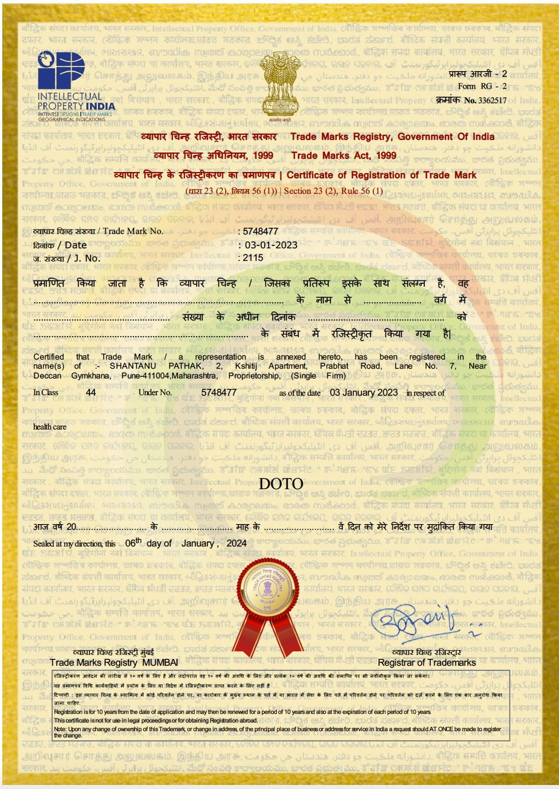

# Positive Birthing Companion

## What this project is

**Positive Birthing Companion** is an offline-first digital companion for the labour room that translates WHO's evidence-based guidance on positive childbirth experiences — the _WHO recommendations on intrapartum care for a positive childbirth experience (2018)_ and the _WHO recommendations on maternal and newborn care for a positive postnatal experience (2022)_ — into simple, actionable bedside interactions for nurses and midwives.

The problem it addresses: 56 intrapartum and 63 postnatal WHO recommendations exist in clinical guideline documents that aren't practical to consult mid-shift, at the bedside, in the next few minutes. This project closes that gap with a tablet/kiosk application built around four modules:

- **Sound & Calm** — curated, evidence-informed relaxation music
- **Hydration Check** — simple temperature/pulse entry with a rule-based hydration prompt (an assessment cue, not a diagnosis)
- **Move & Ease** — guided breathing, movement, and relaxation videos
- **Learn** — short, WHO-sourced answers to common pregnancy, labour, and postnatal questions

It is designed for staff nurses and midwives as primary users — large touch targets, minimal text, one-or-two-tap navigation, usable while gloved and multitasking — with the labouring mother and her companion as secondary viewers. Content works offline and ships in 13 Indian languages at launch. Like our other maternal-health projects, this is explicitly a support tool: it surfaces evidence-based comfort practices and assessment prompts, and does not diagnose, treat, or make autonomous clinical decisions. Clinical judgment stays with the healthcare worker.

## Mission and Vision

**Mission:** To help ensure a safer birthing experience for every pregnant mother.

**Vision:** By 2035, equip frontline health workers through this tool to recognize risks and follow best maternity practices.

## Why this license (Digital Public Good-compatible, dual-track)

This project is built to qualify as a **Digital Public Good (DPG)** under the DPG Standard, which requires both the software and any accompanying content to carry approved open licences that permit free use, modification, and redistribution. Because the product bundles two distinct kinds of assets — application code and media/educational content — a single licence doesn't cleanly cover both, so we use a dual-track approach:

1. **Application code — Apache License 2.0.** As with our related maternal-health engines, Apache 2.0 lets health systems, NGOs, and government digital-health programmes adopt and adapt the codebase — including inside their own facility deployments — with minimal legal friction, and its express patent grant protects adopters building on top of the assessment logic (e.g., the Hydration Check rules). This is also one of the license types the DPG Standard recognises as compliant for software.
2. **Music, video, and educational content — Creative Commons (CC BY or CC BY-SA 4.0).** Content is sourced from Creative Commons-licensed or public-domain material where suitable, and any originally commissioned content (e.g., prenatal yoga/exercise footage, where CC-licensed footage is scarce) is released under an open CC licence rather than proprietary terms. This matches how the DPG Standard treats non-software content and keeps localisation/adaptation (new languages, region-specific content packs) legally straightforward for any adopting facility or partner.

All third-party content is reviewed for licence compatibility and attribution before inclusion, and full DPG registration — confirming licence compliance across both code and content — is tracked as an explicit open item ahead of broader release.

We did not use a single blanket software licence for everything because DPG compliance and real-world content sourcing (CC-licensed music/video libraries) require content-appropriate licensing, not just code-appropriate licensing.

## How decisions get made

- **Application/engineering changes** (UI, offline sync, performance, non-clinical features): standard pull-request review; merged with at least one maintainer approval.
- **Clinical content and logic changes** (Hydration Check thresholds and wording, Learn FAQ content, exercise contraindications/gestational restrictions): require sign-off from the Clinical/Obstetric Advisory Board in addition to normal code review. This mirrors the PRD's own boundary — Hydration Check is a prompt for assessment, not a diagnosis, and Learn is education, not personalised advice — so anything that could blur that line needs clinical, not just engineering, approval.
- **Licensing and content-sourcing decisions** (which CC licence to apply, whether to commission original content, DPG registration steps): decided jointly by maintainers and the UNICEF FemTech Ventures programme partner, since these affect the project's DPG status and downstream reuse rights.
- **Roadmap and scope decisions** (new modules, language rollout sequencing, future-phase items like EMR integration or clinician dashboards): proposed as an issue/RFC, open for comment, decided by maintainer consensus with UNICEF FemTech Ventures input on programme-level priorities (pilot facility, geography, priority languages). Where consensus isn't reached, maintainers and the programme partner decide jointly, with reasoning recorded in the issue.
- **Disputes**: resolved through open discussion in the relevant issue/PR; if unresolved, escalated to a joint maintainer + programme-partner decision.

The recurring principle across this and our other open maternal-health projects: engineering moves at normal open-source speed, but anything touching clinical content, thresholds, or patient-facing claims requires a named clinical reviewer's sign-off before merge — that gate is deliberate, not a bottleneck to be optimised away.

## Community

Positive Birthing Companion is maintained by DOTO Health, with UNICEF FemTech Ventures as programme partner. The current maintainers and how to reach them are listed in [MAINTAINERS.md](./MAINTAINERS.md).

Anyone is welcome to take part. Bug reports and feature requests go through the [GitHub issue templates](./.github/ISSUE_TEMPLATE):
[Report a issue](https://github.com/DOTO-Health/positive-birthing-experience/issues/new?labels=bug&template=bug-report---.md). Code and documentation changes come in as pull requests following [CONTRIBUTING.md](./CONTRIBUTING.md); changes to clinical content and logic also need sign-off from the Clinical/Obstetric Advisory Board. Contributions of media or educational content, including translations, must carry a compatible open licence and are reviewed before inclusion, as described above.

Contributors with sustained, quality work in an area may be invited to become maintainers, as described in [MAINTAINERS.md](./MAINTAINERS.md). Everyone taking part is expected to follow [CODE_OF_CONDUCT.md](./CODE_OF_CONDUCT.md).

---

  

  DOTO and the DOTO logo are trademarks of DOTO Health. Licensed under Apache 2.0 — trademark use is not covered by the code license. See <a href="./LICENSE.md">LICENSE.md</a>.

